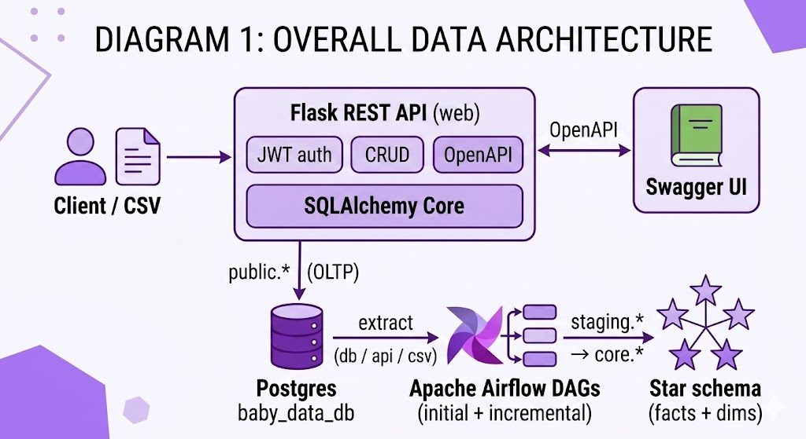
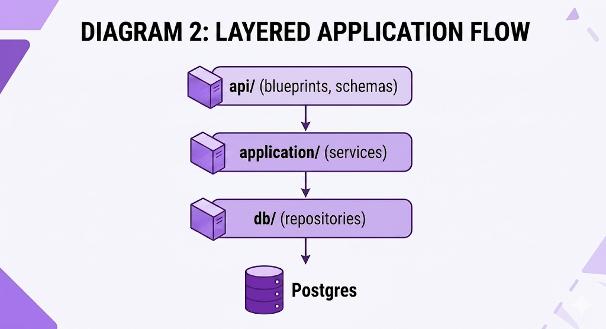
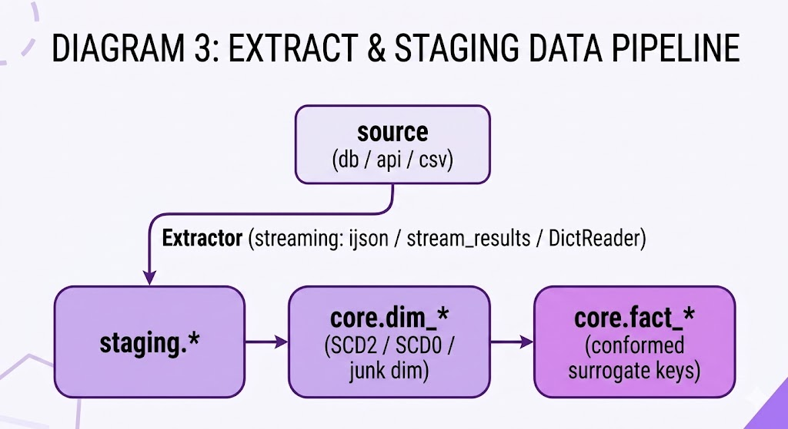
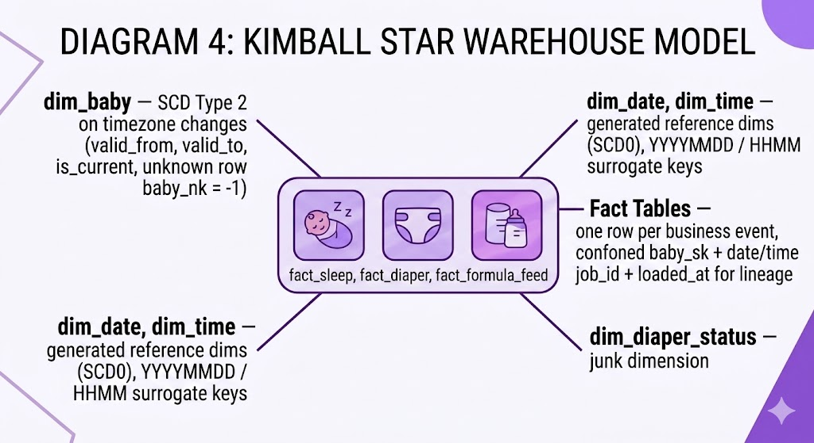

# Baby Data Platform — Flask API + Airflow ETL → Postgres DWH

**Stack:** Flask · Airflow · Postgres · Docker · SQLAlchemy · Alembic · JWT

## Table of contents

- [1. Architecture](#1-architecture)
- [2. Flow 1: Flask operational API](#2-flow-1-flask-operational-api)
  - [2.1 What it does](#21-what-it-does)
  - [2.2 Layered design](#22-layered-design)
  - [2.3 Technologies](#23-technologies)
  - [2.4 Patterns](#24-patterns)
- [3. Flow 2: Airflow ETL → Postgres data warehouse](#3-flow-2-airflow-etl-postgres-data-warehouse)
  - [3.1 What it does](#31-what-it-does)
  - [3.2 The pipeline in one picture](#32-the-pipeline-in-one-picture)
  - [3.3 Warehouse model (Kimball star)](#33-warehouse-model-kimball-star)
  - [3.4 Technologies](#34-technologies)
  - [3.5 Patterns](#35-patterns)
- [4. Optimizations](#4-optimizations)
  - [4.1 Indexes](#41-indexes)
  - [4.2 SQL and data model](#42-sql-and-data-model)
- [5. What this project demonstrates](#5-what-this-project-demonstrates)
- [6. Running it locally](#6-running-it-locally)
  - [6.1 OLTP seed on startup (one-time)](#61-oltp-seed-on-startup-one-time)
- [7. Project structure](#7-project-structure)
  - [7.1 Tests](#71-tests)'
- [License & Usage](#license-&-usage)

---

A small end-to-end data platform I built to practice the full path from an **operational REST API** to an **analytics-ready data warehouse**: collect baby-care events (sleep, diapers, formula feeds) through a Flask service, and load them into a Kimball-style star schema in Postgres using an Apache Airflow pipeline.

The project is intentionally split into **two independent flows** that meet in the same Postgres instance — so the same data can be served transactionally by the app and analytically by the warehouse.

---

## 1. Architecture



Everything is containerized with **Docker Compose**: two Postgres instances (app DB + Airflow metadata DB), the Flask service, and the Airflow init / webserver / scheduler stack.

---

## 2. Flow 1: Flask operational API

The transactional side of the platform. It owns the raw business data.

### 2.1 What it does

- Exposes a REST API for managing babies, sleep sessions, diaper changes and the users who access them.
- Handles authentication with JWT (access + refresh tokens) and two roles (`ADMIN`, `GUEST`) enforced per-endpoint.
- Auto-generates an OpenAPI 3 spec and a Swagger UI.
- On first boot, seeds a demo baby from bundled CSV files so the rest of the stack has something to work with.

### 2.2 Layered design



Each layer only knows about the one below it. Services contain the business rules, repositories contain the SQL, and routes just translate HTTP ↔ service calls.

### 2.3 Technologies

<table>
<colgroup>
<col style="width:50%">
<col style="width:50%">
</colgroup>
<thead>
<tr><th>Technology</th><th>Role</th></tr>
</thead>
<tbody>
<tr><td><strong>Flask</strong> + <strong>flask-smorest</strong></td><td>Routing, OpenAPI, Swagger UI</td></tr>
<tr><td><strong>flask-jwt-extended</strong></td><td>Access / refresh tokens, <code>@jwt_required</code> guards</td></tr>
<tr><td><strong>passlib[argon2]</strong></td><td>Password hashing</td></tr>
<tr><td><strong>marshmallow</strong> + <strong>marshmallow-dataclass</strong></td><td>Request/response validation and serialization</td></tr>
<tr><td><strong>SQLAlchemy 2.x Core</strong> (not the ORM)</td><td>Explicit <code>Table</code> definitions, composable <code>insert/select/update/delete</code> statements</td></tr>
<tr><td><strong>psycopg2</strong></td><td>Postgres driver</td></tr>
<tr><td><strong>Alembic</strong></td><td>Schema migrations for the warehouse side</td></tr>
</tbody>
</table>

### 2.4 Patterns

<table>
<colgroup>
<col style="width:50%">
<col style="width:50%">
</colgroup>
<thead>
<tr><th>Pattern</th><th>How it's applied</th></tr>
</thead>
<tbody>
<tr><td><strong>Layered architecture</strong> (API → Service → Repository → DB)</td><td>Each layer only talks to the one below; routes stay thin</td></tr>
<tr><td><strong>Repository pattern</strong> behind explicit interfaces (<code>BabyRepository</code>, <code>SleepRepository</code>, …)</td><td>Services depend on the interface, not on Postgres</td></tr>
<tr><td><strong>Service layer</strong></td><td>Single place for business rules (validation, timezone checks, authorization)</td></tr>
<tr><td><strong>DTO via dataclasses</strong></td><td>Request payloads via marshmallow-dataclass</td></tr>
<tr><td><strong>Decorator-based authorization</strong> (<code>@admin_required</code>, <code>@all_roles_allowed</code>)</td><td>Role checks on top of JWT</td></tr>
</tbody>
</table>

---

## 3. Flow 2: Airflow ETL → Postgres data warehouse

The analytical side. It treats the Flask DB and external sources as raw inputs and builds a clean, conformed star schema on top.

### 3.1 What it does

- Pulls data from **three source types** — the Flask REST API (diapers), the operational Postgres tables (babies, sleep), and a daily CSV drop (formula feeds).
- Lands everything into a `staging` schema with raw types, a row hash and job lineage columns.
- Transform staging into a `core` schema (dimensions + facts) with hand-written, parameterized SQL.
- Tracks every run in a `metadata.etl_job` table (dag_id, task_id, logical_date, status, rows loaded, error, parent job id).
- Supports both an **initial full load** (`@once`) and a **daily incremental load** (`0 1 * * *`) with the same abstractions.

### 3.2 The pipeline in one picture



### 3.3 Warehouse model (Kimball star)



- `dim_baby` — **SCD Type 2** on timezone changes (`valid_from`, `valid_to`, `is_current`, unknown row `baby_nk = -1`).
- `dim_date`, `dim_time` — **SCD Type 0** generated reference dims (SCD0), `YYYYMMDD` / `HHMM` surrogate keys.
- `dim_diaper_status` — **SCD Type 1** junk dimension.
- `fact_sleep`, `fact_diaper`, `fact_formula_feed` — one row per business event, conformed `baby_sk` + date/time keys, `job_id` + `loaded_at` for lineage.

### 3.4 Technologies

<table>
<colgroup>
<col style="width:50%">
<col style="width:50%">
</colgroup>
<thead>
<tr><th>Technology</th><th>Role</th></tr>
</thead>
<tbody>
<tr><td><strong>Apache Airflow 2.9</strong> (LocalExecutor)</td><td>DAGs, pools, task retries, <code>on_failure_callback</code></td></tr>
<tr><td><strong>Airflow providers</strong></td><td><code>postgres</code> (connection + <code>PostgresHook.get_sqlalchemy_engine</code>), <code>http</code> (API extractor connection)</td></tr>
<tr><td><strong>SQLAlchemy Core</strong></td><td>Staging inserts and table metadata</td></tr>
<tr><td><strong>ijson</strong></td><td>Streaming JSON parse of API responses (large payloads stay off-heap)</td></tr>
<tr><td><strong>requests</strong></td><td>Authenticated calls to the Flask API (same JWT flow)</td></tr>
<tr><td><strong>pendulum</strong></td><td>Timezone-aware datetimes across the pipeline</td></tr>
<tr><td><strong>psycopg2</strong> + hand-written SQL</td><td>Transform/load step execution</td></tr>
<tr><td><strong>Alembic</strong></td><td>Versioned migrations for <code>staging</code>, <code>core</code>, and <code>metadata</code> schemas</td></tr>
</tbody>
</table>

### 3.5 Patterns

<table>
<colgroup>
<col style="width:50%">
<col style="width:50%">
</colgroup>
<thead>
<tr><th>Pattern</th><th>How it's applied</th></tr>
</thead>
<tbody>
<tr><td><strong>Template Method</strong> (<code>StagingExtractRunnerTemplate</code> / <code>CoreExtractRunnerTemplate</code>)</td><td>Shared run skeleton: dedup → start job → metadata → work → <code>finally</code>; each entity fills the hooks</td></tr>
<tr><td><strong>Abstract Factory</strong> (<code>ExtractorFactory</code>)</td><td>Maps <code>"csv" | "api" | "db"</code> to extractors; runners ask for a source kind, not a concrete class</td></tr>
<tr><td><strong>Strategy via abstract hooks</strong></td><td>Per-runner overrides of <code>get_sql</code>, <code>load_type</code>, <code>source_type</code>, <code>mapper</code>, <code>build_extractor</code></td></tr>
<tr><td><strong>Repository pattern</strong> (stg / core / metadata repos)</td><td><code>StgPostgresRepository</code> (chunked inserts + broken-row log), <code>CorePostgresRepository</code> (SQL + truncate), <code>MetadataPostgresRepository</code> (job lifecycle)</td></tr>
<tr><td><strong>Idempotency + dedup</strong></td><td><code>(dag_id, task_id, logical_date)</code> identifies a run; success re-run raises <code>AirflowSkipException</code></td></tr>
<tr><td><strong>Parent-job linkage</strong></td><td>Core loads record the staging job that produced their rows (queryable lineage)</td></tr>
<tr><td><strong>Separation of bad rows</strong></td><td><code>BrokenEntity</code> rows go to a side log; one bad row does not fail the batch</td></tr>
<tr><td><strong>Orchestration gates</strong></td><td><code>stg_tasks >> stg_done >> dim_tasks >> dim_done >> fact_tasks</code> with <code>EmptyOperator</code> for readable DAG deps</td></tr>
</tbody>
</table>

---

## 4. Optimizations

A focused performance pass on the warehouse side. Each row lists one concrete change, the query/plan it affected, and the complexity change it produced.

### 4.1 Indexes

<table>
<colgroup>
<col style="width:50%">
<col style="width:50%">
</colgroup>
<thead>
<tr><th>Change</th><th>Before → After</th></tr>
</thead>
<tbody>
<tr><td><code>idx_dim_baby_current</code> (UNIQUE, partial <code>WHERE is_current=TRUE</code>)</td><td>seq scan of <code>dim_baby</code> → <code>O(log n)</code> index probe</td></tr>
<tr><td><code>idx_dim_baby_nk_validity</code></td><td>seq scan per event → <code>O(log n)</code> seek + tiny range filter</td></tr>
<tr><td><code>idx_etl_job_dedup_lookup</code></td><td>full-table <code>EXISTS</code> → <code>O(1)</code> index probe</td></tr>
<tr><td><code>idx_etl_job_latest_success</code></td><td>partial match + sort + <code>LIMIT 1</code> → <code>O(1)</code> backward index scan</td></tr>
<tr><td><code>idx_etl_job_source_path_success</code> (partial <code>WHERE status='success'</code>)</td><td>seq scan per file → <code>O(1)</code> index probe, small on-disk</td></tr>
</tbody>
</table>

### 4.2 SQL and data model

<table>
<colgroup>
<col style="width:50%">
<col style="width:50%">
</colgroup>
<thead>
<tr><th>Change</th><th>Before → After</th></tr>
</thead>
<tbody>
<tr><td>Range-partitioned fact tables by month on <code>*_date_sk</code> (monthly partitions + default)</td><td>Full-table scan on date filters → partition pruning (<code>O(months_touched)</code>); retention drop goes from <code>DELETE + VACUUM</code> to <code>O(1) DROP TABLE</code></td></tr>
<tr><td>SCD2 range join in <strong>initial</strong> fact loads (was <code>is_current=TRUE</code>; now uses both range and <code>is_current</code>)</td><td>Initial and incremental share one semantics; historically correct <code>baby_sk</code> on backfills; join uses <code>idx_dim_baby_nk_validity</code></td></tr>
<tr><td>Incremental watermark in <code>metadata.etl_job.last_loaded_event_ts_watermark</code></td><td><code>SELECT MAX(col) FROM staging.*</code> (<code>O(n)</code>) → single-row lookup via <code>idx_etl_job_latest_success</code> (<code>O(1)</code>)</td></tr>
<tr><td>Staging incremental SQL parameterized with <code>:watermark_ts</code></td><td>No <code>MAX()</code> CTE over staging; first run handled naturally (<code>:watermark_ts IS NULL</code>)</td></tr>
<tr><td>Staging chunk insert switched to executemany</td><td>One inlined <code>INSERT … VALUES (…,…,…)</code> per chunk → batched parameterized executemany</td></tr>
</tbody>
</table>

---

## 5. What this project demonstrates

- Designing two **independent but interoperable** systems (OLTP + OLAP) over the same database.
- Writing clean layers with **explicit interfaces**, so the services don't care whether data comes from Postgres, an API, or a CSV.
- Reasoning about **data-warehouse modeling** — star schema, conformed dimensions, SCD2, surrogate vs natural keys, fact grain.
- Building a pipeline that is **observable** (job metadata + lineage) and **safe to re-run** (dedup + skip + parent-job linkage).
- Handling **real-world data quality**: streaming large payloads, isolating broken rows, and chunked bulk inserts.
- Packaging everything in **Docker Compose** so it runs with a single command.

---

## 6. Running it locally

```bash
# 1. create a .env file with POSTGRES_USER / POSTGRES_PASSWORD / POSTGRES_DB / POSTGRES_HOST / POSTGRES_PORT
cp .env.example .env    # then edit

# 2. bring the stack up
docker compose up --build

# 3. open:
#    Flask API + Swagger UI  →  http://localhost:5000/swagger-ui
#    Airflow UI              →  http://localhost:8080   (admin / admin)

# 4. trigger the DAGs from the Airflow UI:
#    - initial_etl      (one-shot: public → staging → core)
#    - incremental_etl  (daily at 01:00 UTC)
```

### 6.1 OLTP seed on startup (one-time)

Before the Flask API starts, Compose runs a **`web-init`** one-shot container (`python -m flask_app.seed`) that loads a **predefined demo dataset** into the operational database so the OLTP side is not empty and the ETL DAGs have real rows to extract.

| What | Detail |
|------|--------|
| Dataset | Bundled CSVs under `flask_app/data_files/` — demo baby **Adriana** (`Europe/Chisinau`), plus `sleep_data.csv` and `diaper_data.csv` |
| When it runs | Once per fresh environment, on the first successful `web-init` (before `web` / Gunicorn starts) |
| Skip on restart | After import, seed creates `flask_app/data_files/_initial_load_done.txt`. If that file exists, CSV import is skipped so the same data is not inserted again |
| Why it persists | **Postgres** data lives in the Docker volume `baby_data_db`. The **flag file** lives on the bind-mounted `./flask_app` tree, so it survives container restarts on the same machine |
| Re-seed from scratch | Remove `_initial_load_done.txt` and reset or recreate the DB volume if you need a clean OLTP load again |

The seed step also creates the bootstrap **admin** user from `.env` (`BOOTSTRAP_ADMIN_USERNAME` / `BOOTSTRAP_ADMIN_PASSWORD`) when that account does not exist yet.

After the stack is up, trigger **`initial_etl`** in Airflow (step 4 above) to copy this OLTP data into staging and the warehouse.

---

## 7. Project structure

```
flask_app/           # Flow 1 — REST API
  api/               #   blueprints + marshmallow schemas + auth decorators
  application/       #   services + CSV import
  domain/            #   entities (Baby, Sleep, Diaper, User)
  db/                #   repositories, repository interfaces, table metadata, engine

etl/                 # Flow 2 — ETL code
  extract/           #   extractors (csv/api/db), mappers, entities, auth client
  transform_load/    #   template for core runners
  runners/           #   per-entity runners (stg + core, initial + incremental)
  db/                #   repositories, tables (staging/core/metadata), schemas
  sql/               #   hand-written SQL (organized by stg/core × initial/incremental)
  alembic/           #   migrations for staging/core/metadata schemas

airflow/dags/        # DAG definitions (initial + incremental)
tests/               # Unit tests (Flask + ETL; see tests/README.md)
requirements/        # Separate pinned deps for flask vs etl
docker-compose.yml   # Postgres x2, Flask web, Airflow init/webserver/scheduler
```

### 7.1 Tests

**385 unit tests** — no live database, Airflow, or HTTP service. See [tests/README.md](tests/README.md) for layout and conventions.

| Area | Count | Covers |
|------|------:|--------|
| Flask API (`tests/flask_app_tests/`) | **214** | API routes & auth, service-layer validation, repository SQL |
| ETL pipeline (`tests/etl_flow_tests/`) | **171** | Extractors, mappers, runners, staging/core/metadata repos |

```bash
pytest tests                              # all tests
pytest tests/flask_app_tests/api_layer    # Flask API layer only
pytest tests/etl_flow_tests/runners       # ETL runners only
```

---
## License & Usage

Disclaimer: This project is for  portfolio and demonstration purposes only. All rights reserved. No permission is granted to use, modify, or redistribute this software for any purpose. The software is provided "as is", and in no event shall the authors be liable for any claim, damages or other liability, whether in an action of contract, tort or otherwise, arising from, out of or in connection with the software or the use or other dealings in the software.
